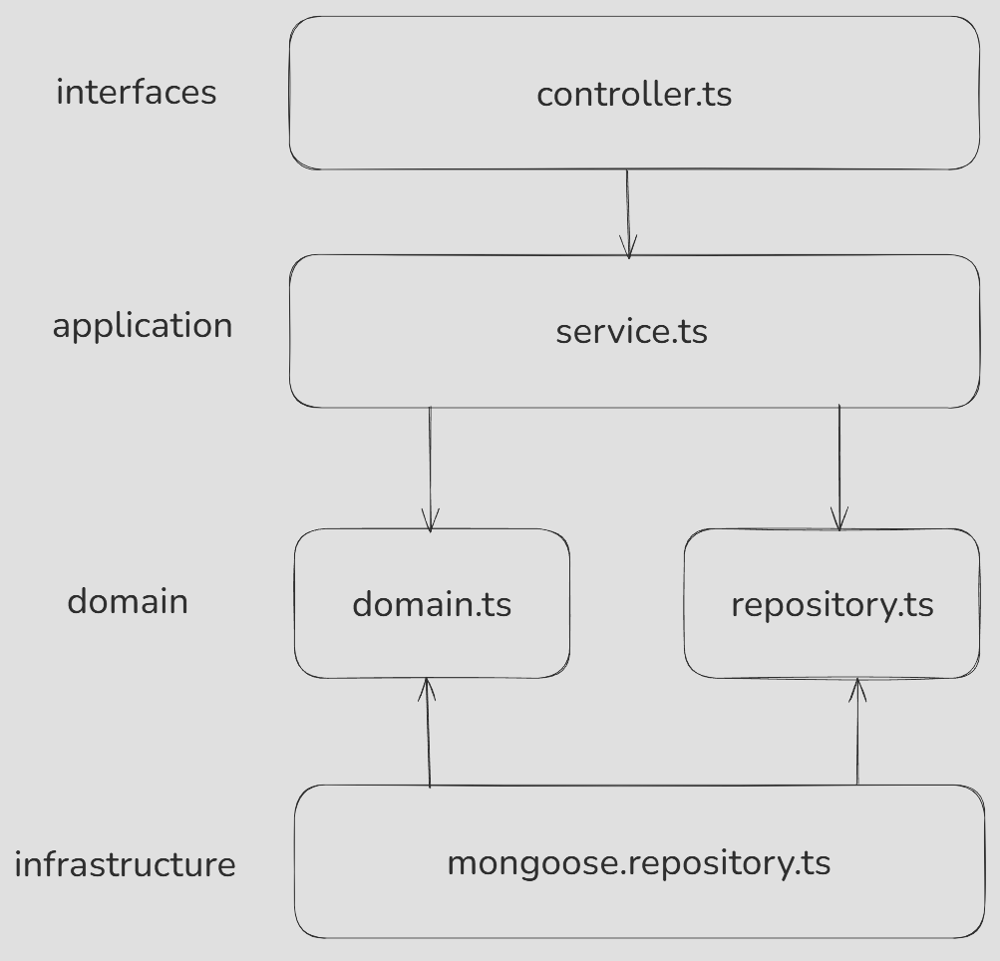

# Assignment

## 실행 방법

### 개발 환경 실행
```
1. docker compose -f docker-compose.dev.yml up -d
2. npm install
3. npm run dev
```

### 운영 환경 실행
프로젝트 최상단 [test.http](./test.http)로 API 테스트 가능합니다. 
```
1. docker compose build // 이미지 빌드
2. docker compose up -d // 서버 실행
3. docker down // 서버 종료
```


## 프로젝트 구조

```
ㄴauth-server
  ㄴauth (auth API) 
  ㄴconfig (DB Config, 개발환경 env 세팅)
  ㄴshared (데코레이터, enum, 공용 라이브러리, 타입)
  ㄴuser (user API)
ㄴevent-server
  ㄴconfig (DB Config, 개발환경 env 세팅)
  ㄴevent (event API)
  ㄴreward (reward API)
  ㄴshared (데코레이터)
ㄴgateway-server
  ㄴconfig (개발환경 env 세팅)
  ㄴshared
    ㄴdecorators (데코레이터)
    ㄴguard (jwt, role guard)
    ㄴinterfaces (jwt payload 인터페이스)
    ㄴlogger (로깅)
    ㄴmiddleware (favicon.ico 요청 필터링 middleware)
 ㄴproxy.controller.ts (모든 요청을 받아서 처리하는 controller)
 ㄴproxy.service.ts (요청 프록시 로직)
 ㄴrouter.service.ts (요청이 어느 서버로 가야하는지 지정된 라우팅 테이블 역할)
```

### API 구조

